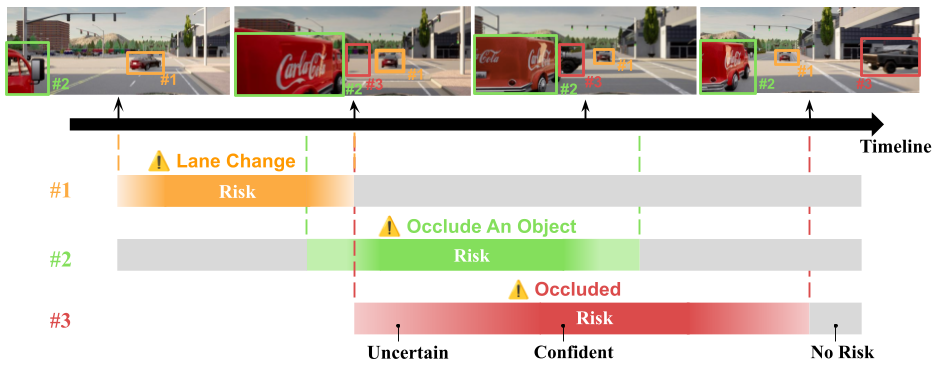
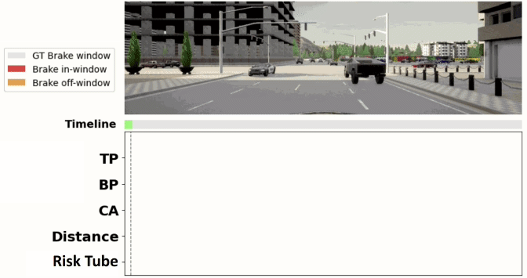

# [ICRA 2026] Conformal Risk Tube Prediction


  [**Project Page**](https://hcis-lab.github.io/CRTP/)
| [**Paper**]()

<p align="center">
   
   <sub><em> Risk Tube Prediction models the joint spatial–temporal uncertainty of risk. <br/>
   </em></sub>
</p>

This repository contains the official codebase for training, evaluation, and visualization of the methods described in:

> **Uncertainty-Aware Vision-based Risk Object Identification via 
Conformal Risk Tube Prediction** <br/>
> Kai-Yu Fu and
[Yi-Ting Chen](https://sites.google.com/site/yitingchen0524) <br/>
> [National Yang Ming Chiao Tung University](https://www.nycu.edu.tw/nycu/en/index)


<p align="center">
   
   <br/>
   <sub><em>  Visual Risk Object Identification Result.
   </em></sub>
</p>

<p align="center">
    
   <br/>
   <sub><em> Conformal Calibration Result.
   </em></sub>
</p>


## ⚙️ Getting Started

### 📝 System Setup
* **Operating System:** Linux Ubuntu 18.04
* **Python Version:** 3.7
* **PyTorch Version:** 1.10.1
* **CUDA Version:** 11.3
* **GPU:** Nvidia RTX 3090
* **CPU:** Intel Core i7-11700KF

### 📥 Dependency Installation

1. Clone the Repository
    ```bash
    git clone https://github.com/doraemonhappy/my-first-repo.git
    ```

2. Create and activate a new [Conda](https://docs.anaconda.com/miniconda/) environment:
    ```bash
    cd CRTP
    conda env create -f environment.yml --name CRTP
    conda activate CRTP
    ```

### 📦 Datasets Downloads

<p align="center">
   
   </br>
   <sub><em> Multiple Coexisting Risks Dataset
   </em></sub>
</p>

We construct the Multiple Coexisting Risks dataset, which integrates the four risk categories including Interaction, Collision, Obstacle, and Occlusion. 
Within a single scenario, multiple risk categories can occur concurrently or in sequence. 
In total, we obtain about 1,000 scenarios, which enables comprehensive validation under multi-risk settings.

* Download `Multiple_Coexisting_Risks_Dataset` [here](https://drive.google.com/drive/folders/13hRzEaJadxPIgf_hRIaQVJq9Pr1SsGIL?usp=drive_link). Please extract all train{xx}.zip files and place their contents into the same folder.
* Please refer to the [dataset description](./Multiple_Coexisting_Risks_Dataset_Description/README.md) for more details.

## 🚀 Usage

### Training
```bash
# step 1: Risk Category Classifier Pre-training
python train_cls.py

# step 2: Full Architecture CRTP Training
python train.py
```

### Evaluation (Metric: Coverage, TV, TC, BA, Risk-IOU)
```bash
# Risk Category Classifier Inference
python inference_cls.py

# Full Architecture CRTP Inference
python inference.py               # Given GT Bounding Box 
python inference_yolo_detector.py # Given Perception Bounding Box 

```

### Visualization & Downstream Task (Braking Alerts)
```bash
# Visualization and Save Braking Alerts (data root folder should contain a single scenario)
python vis_roi_and_save_braking_alerts.py --mode 'vis_save'

# Braking Alerts Metric Evaluation (data root folder should contain all scenarios)
python vis_roi_and_save_braking_alerts.py --mode 'metric'
```

### Visualization of Braking Alerts
```bash
# First run CRTP and every baseline in ./Baselines/Braking_Alerts to save all braking alerts.
python compare_all_roi_braking_alerts.py
```
<p align="center">
   
   <br/>
   <sub><em> Our calibrated, temporally aligned Risk Tube suppresses nuisance interventions.
   </em></sub>
</p>

## 📄 BibTeX

If our work contributes to your research, please consider citing it with the following BibTeX entry:

```bibtex
TBD
```

<!-- # 📜 License

This project is licensed under the [GPL-3.0 LICENSE](./LICENSE). -->


## 🙌 Acknowledgment

We acknowledge that the implementation used in this project are adapted from [RiskBench](https://hcis-lab.github.io/RiskBench/), [SAOCP](https://github.com/salesforce/online_conformal).

Thanks to these great open-source projects!
